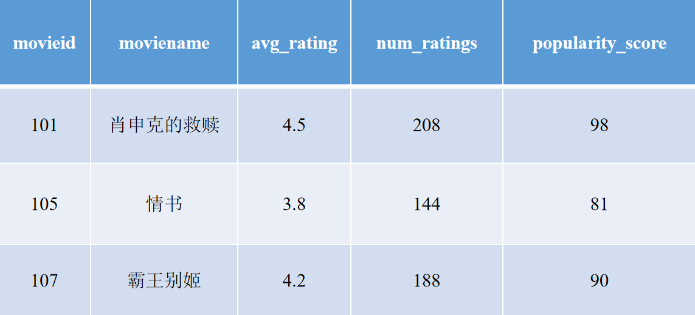
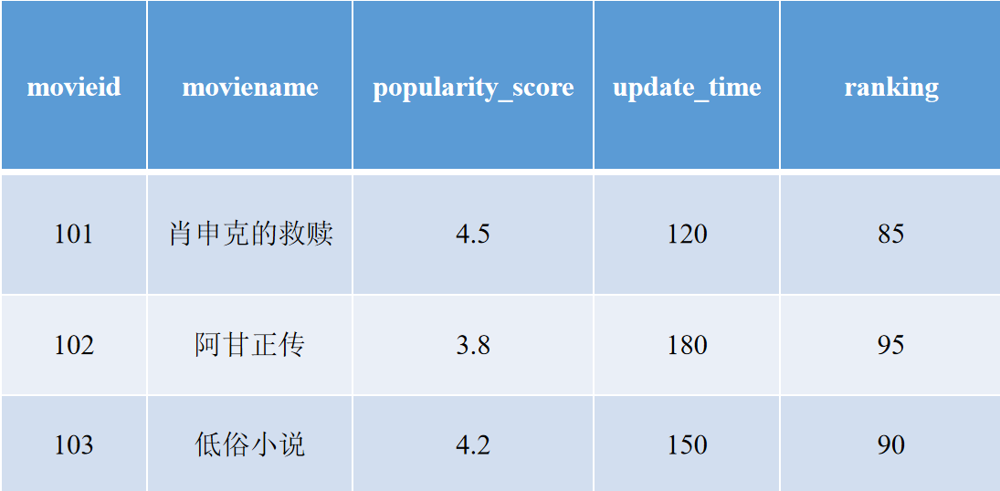
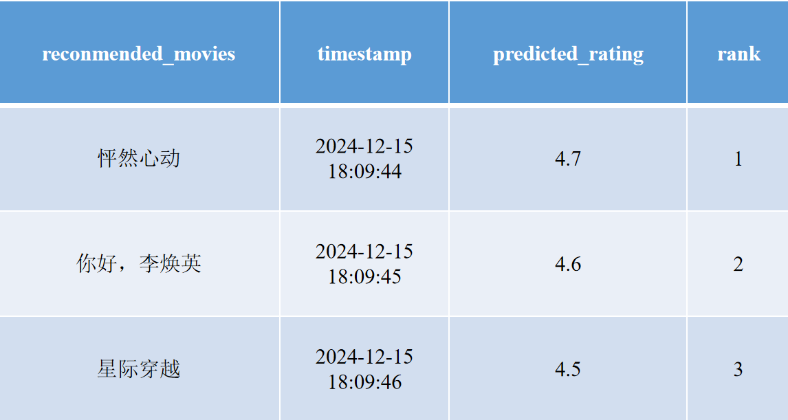

# 基于Spark的电影推荐系统
## 1. 项目目的

本项目开发了一个电影推荐系统，通过整合大数据技术，实现对电影数据的清洗、建模和推荐，旨在结合用户行为数据，通过个性化推荐和便捷搜索功能，为用户提供全面、精准、高效的电影选择和观影体验。

具体实现如下功能：

- **电影数据管理**：将电影数据存储在数据库中，为后续推荐系统提供数据源；

- **用户行为数据收集**：用户可以收藏电影、参与电影评价等管理自己的电影偏好；

- **电影推荐**：系统会根据用户自己的收藏、评价等行为为用户提供更精准的个性化电影推荐；

- **电影搜索**：用户可以直接搜索电影名称，也可以按照类别分类搜索，或者根据收集到的额外信息（时间、热度、评分）搜索电影，实现高效搜索。

## 2. 项目方法
### 2.1 数据库设计模块
#### 数据库名：movie
- 表1 **user**：存储用户信息。

|  **字段名称** 	| **数据类型** 	|           **约束**          	|   **描述**   	|
|:-------------:	|:------------:	|:---------------------------:	|:------------:	|
| userid        	| int(11)      	| PRIMARY KEY, AUTO_INCREMENT 	| 用户ID       	|
| username      	| varchar(255) 	| NULLABLE                    	| 用户名       	|
| password      	| varchar(255) 	| NULLABLE                    	| 密码         	|
| registertime  	| datetime     	| NULLABLE                    	| 注册时间     	|
| lastlogintime 	| datetime     	| NULLABLE                    	| 上次登录时间 	|
| email         	| varchar(255) 	| NULLABLE                    	| 用户邮箱     	|

- 表2 **alstab**：存储用户评分数据，表示哪些用户为哪些电影评分。

| **字段名称** 	| **数据类型** 	| **约束** 	| **描述** 	|
|:------------:	|:------------:	|:--------:	|:--------:	|
| userId       	| int(11)      	| NOT NULL 	| 用户ID   	|
| movieId      	| int(11)      	| NOT NULL 	| 电影ID   	|
| rating       	| double       	| NOT NULL 	| 评分     	|

- 表3 **browse**：存储用户浏览记录，表示用户查看过哪些电影。

| **字段名称** 	|  **数据类型**  	|           **约束**          	|                **描述**                	|
|:------------:	|:--------------:	|:---------------------------:	|:--------------------------------------:	|
| browseid     	| int(11)        	| PRIMARY KEY, AUTO_INCREMENT 	| 浏览记录ID                             	|
| userid       	| int(11)        	| NULLABLE                    	| 用户ID                                 	|
| movieids     	| varchar(10000) 	| NULLABLE                    	| 用户浏览的电影ID，多个电影ID用逗号分隔 	|
| browsetime   	| datetime       	| NULLABLE                    	| 浏览时间                               	|

- 表4 **category**：存储电影类别信息。

| **字段名称** 	| **数据类型** 	|           **约束**          	| **描述** 	|
|:------------:	|:------------:	|:---------------------------:	|:--------:	|
| categoryid   	| int(11)      	| PRIMARY KEY, AUTO_INCREMENT 	| 类别ID   	|
| category     	| varchar(255) 	| NULLABLE                    	| 类别名称 	|

- 表5 **movie**：存储电影基本信息。

| **字段名称** 	|  **数据类型**  	|           **约束**          	|       **描述**       	|
|:------------:	|:--------------:	|:---------------------------:	|:--------------------:	|
| movieid      	| int(11)        	| PRIMARY KEY, AUTO_INCREMENT 	| 电影ID               	|
| moviename    	| varchar(1000)  	| NULLABLE                    	| 电影名称             	|
| showyear     	| date           	| NULLABLE                    	| 上映年份             	|
| nation       	| varchar(255)   	| NULLABLE                    	| 国家/地区            	|
| director     	| varchar(1000)  	| NULLABLE                    	| 导演                 	|
| leadactors   	| varchar(1000)  	| NULLABLE                    	| 主演                 	|
| screenwriter 	| varchar(255)   	| NULLABLE                    	| 编剧                 	|
| picture      	| varchar(1000)  	| NULLABLE                    	| 电影海报链接         	|
| averating    	| double(11,1)   	| NULLABLE                    	| 电影总评分           	|
| numrating    	| int(11)        	| NULLABLE                    	| 评分人数（热度）     	|
| description  	| varchar(1000)  	| NULLABLE                    	| 剧情简介             	|
| typelist     	| varchar(255)   	| NULLABLE                    	| 电影类型（多个类型） 	|
| backpost     	| varchar(15000) 	| NULLABLE                    	| 背景介绍（多媒体等） 	|

- 表6 **movie_category**：电影与类别的关联表，用于表示一部电影属于多个类别。

| **字段名称** 	| **数据类型** 	|           **约束**          	| **描述** 	|
|:------------:	|:------------:	|:---------------------------:	|:--------:	|
| movcatid     	| int(11)      	| PRIMARY KEY, AUTO_INCREMENT 	| 记录ID   	|
| movieid      	| int(11)      	| NULLABLE                    	| 电影ID   	|
| categoryid   	| int(11)      	| NULLABLE                    	| 类别ID   	|

- 表7 **rectab**：存储用户电影推荐记录，表示某些用户可能喜欢哪些电影。

| **字段名称** 	| **数据类型** 	| **约束** 	|           **描述**           	|
|:------------:	|:------------:	|:--------:	|:----------------------------:	|
| userid       	| int(11)      	| NOT NULL 	| 用户ID                       	|
| movieids     	| varchar(50)  	| NOT NULL 	| 推荐的电影ID，多个用逗号分隔 	|

- 表8 **review**：存储用户对电影的评论信息。

| **字段名称** 	| **数据类型** 	|           **约束**          	|    **描述**   	|
|:------------:	|:------------:	|:---------------------------:	|:-------------:	|
| reviewid     	| int(11)      	| PRIMARY KEY, AUTO_INCREMENT 	| 评论ID        	|
| userid       	| int(11)      	| NULLABLE                    	| 用户ID        	|
| movieid      	| int(11)      	| NULLABLE                    	| 电影ID        	|
| content      	| varchar(255) 	| NULLABLE                    	| 评论内容      	|
| star         	| double(11,1) 	| NULLABLE                    	| 评分（1-5星） 	|
| reviewtime   	| datetime     	| NULLABLE                    	| 评论时间      	|

- 表9 **similartab**：存储电影之间的相似度数据，基于某些算法计算电影间的相似度。

| **字段名称** 	| **数据类型** 	| **约束** 	|     **描述**     	|
|:------------:	|:------------:	|:--------:	|:----------------:	|
| itemid1      	| text         	| NULLABLE 	| 电影ID 1         	|
| itemid2      	| text         	| NULLABLE 	| 电影ID 2         	|
| similar      	| double       	| NOT NULL 	| 两部电影的相似度 	|

- 表10 **topdefaultmovies**：存储网站推荐的电影数据。

| **字段名称** 	| **数据类型** 	|           **约束**          	| **描述** 	|
|:------------:	|:------------:	|:---------------------------:	|:--------:	|
| id           	| int(12)      	| PRIMARY KEY, AUTO_INCREMENT 	| 记录ID   	|
| movieid      	| int(12)      	| NOT NULL                    	| 电影ID   	|
| moviename    	| varchar(255) 	| NOT NULL                    	| 电影名称 	|

### 2.2 电影网站模块
- **目的**：为用户提供电影浏览、查询功能，并且根据用户的浏览记录提供推荐功能。
- **环境**：基于SSM框架（Spring + SpringMVC + MyBatis），使用IntelliJ IDEA开发
- **SSM架构**：如下图所示

### 2.3 推荐系统模块（基于Spark）
**目的**：通过大数据处理与分析，生成个性化电影推荐结果。
**架构**：
- 数据处理：Hadoop,Hive,Spark; 

- 消息队列：Kafka,Flume; 

- 实时流处理：Zookeeper,Spark Streaming; 

- 数据存储：MySQL 

**实现流程**：
- 服务器规划（linux镜像为centos6）：
    - spark101，分配8G内存，4核 
    - spark102，分配6G内存，4核 
    - spark103，分配6G内存，4核

- 环境搭建：
    - hdfs搭建：spark1上搭建namenode,secondary namenode,datanode；spark2上搭建datanode；spark3上搭建datanode。
    - yarn搭建：spark1上搭建resourcemanager,nodemanager；spark2上搭建nodemanager；spark3上搭建nodemanager。
    - mysql搭建：在spark2上搭建。
    - hive搭建：在spark1上搭建。
    - spark集群搭建：搭建standalone模式，spark1为master，其他为worker。

- 数据清洗（上传数据值hdfs中）：通过Spark整合HDFS与Hive进行ETL操作，清洗和整理原始电影数据； 

- 模型训练：基于ALS算法构建推荐模型，通过RMSE评估选择最优参数； 

- 推荐结果生成：针对用户行为生成个性化推荐，并实时更新到MySQL数据库； 

- 实时数据处理：
    - 数据发送：安装nginx，用来接收电影网站上用户的点击信息，写入本地文件；安装flume，实时监控本地文件，将数据发送至kafka消息队列中。 

    - 数据接收处理：安装zookeeper，安装kafka，用来接收发送数据。 
    
发送通过Kafka和Flume实现用户点击行为数据的流式传输，基于Spark Streaming动态处理数据，为新用户生成实时推荐结果。 

**推荐系统流程图**：如下图所示 

**推荐系统架构图**：如下图所示 

## 3. 项目结果
实时热门电影分析表

实时热门电影分析运行结果图

用户行为统计表

用户行为运行结果图

电影评分统计表

电影评分统计运行结果图

模型评估结果表

模型评估运行结果图

推荐结果表

推荐结果运行图

## 4. 项目分工
- 李惠玲：服务器环境部署和算法开发(25%)
- 赵乙茗：数据库设计与算法实现(25%)
- 徐嘉雯：后端开发与接口实现(25%)
- 周晓：前端开发与系统集成(25%)
